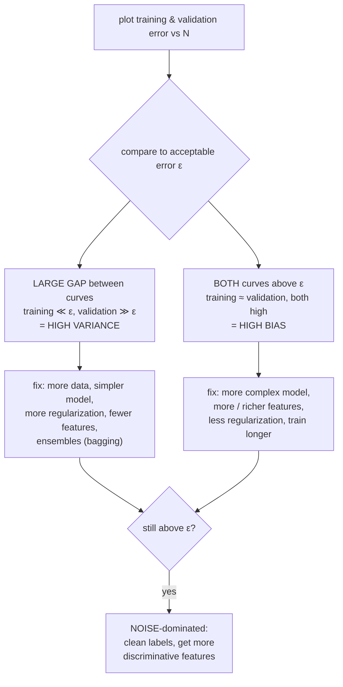

# Learning curve

A plot of **training error and validation error against training-set size $N$**, used to diagnose whether a poorly-performing model is suffering from **high bias** or **high variance**. This is the §2a sketch question on the past mock exam.

## The three properties (always hold)

1. **Validation error ≥ training error** — the model is optimized for the training set; held-out points are at best as easy.
2. **Validation error decreases monotonically in $N$** — more data shrinks variance of $h_D$.
3. **Training error never decreases with $N$** (stays flat or rises) — a fixed-capacity model can't perfectly fit progressively more diverse points; each new datum can only raise or hold training error.

So as $N$ grows, the two curves approach each other. The asymptotic level of both is **bias² + noise** — the irreducible floor.

## Diagnosing high variance vs high bias

Compare the curves to your **acceptable test error** $\varepsilon$:

The signal is the **gap**:

- **High variance** = wide gap. The model fits the training set well but not the validation set. Variance is the term hurting you. More data will help (validation curve has more room to drop).
- **High bias** = small gap, both curves high. The model can't even fit the training set. More data won't help — you need a more flexible model or better features.
- **Both fail after fixes** = high noise. The data itself doesn't determine $y$ from $x$ well enough.

## Why the three properties hold (intuition)

| Property | Why |
| --- | --- |
| Val ≥ train | Training fits the loss directly on training data. Validation comes from an unseen draw and is at best matched. |
| Val decreases with $N$ | The estimator $h_D$ has variance scaling roughly as $1/N$ (or $\sigma^2/N$ for nice estimators); more data → less variance → less generalization gap → val error converges to bias² + noise. |
| Train never decreases | Training error is a *minimum* over a hypothesis class. Adding a new point cannot make the previous min lower; can only force it higher (if the new point isn't fittable) or equal. |

## Distinct from the regularization curve

Don't confuse this with the validation-error U-curve plotted against $\lambda$ in [[lecture-10-loss-functions-regularization|L10]] or against iteration count $M$ in [[early-stopping]]:

| Curve | x-axis | Shape of validation error |
| --- | --- | --- |
| **Learning curve** | $N$ (training-set size) | monotonically decreasing |
| **Regularization curve** | $\lambda$ (regularization strength) | U-shaped |
| **Iteration curve** | $M$ (number of training iterations) | U-shaped |

The learning curve diagnoses **what's wrong** with the current model. The regularization / iteration curves tell you **how to dial** the chosen model to its sweet spot.

## Exam-relevant facts

- Three properties: val ≥ train; val ↓ with $N$; train never ↓ with $N$.
- **Wide gap** with train below ε = **high variance**. Fix: more data, simpler model, regularize, ensemble.
- **Both curves above ε** with small gap = **high bias**. Fix: more complex model, more features, less regularization.
- Asymptote of both curves as $N \to \infty$ is **bias² + irreducible noise**.

## Related

- [[bias-variance-decomposition]] — the formal target of the diagnosis.
- [[regularization]] — fixes high variance.
- [[overfitting-underfitting]] — qualitative names for the regimes.
- [[bagging]] — variance-reduction algorithm (L12).
- [[lecture-11-bias-variance|SLP L11]] — source.
