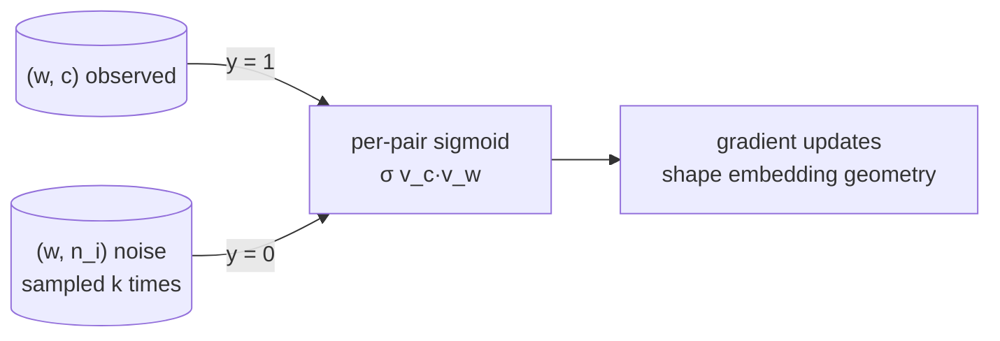

# Negative sampling

A training trick for [[word2vec|Word2Vec]] that replaces the **full-vocabulary softmax** with a much cheaper **binary classification per pair** ([[30-Sources/NLP/pdf/Session 13 - Word Embeddings.pdf#page=16|slide 16]]). It's the mechanism that makes Skip-gram practical at realistic vocabulary sizes.

The blueprint flags this as **medium weight**: Quiz III Q7, Q18 (and Q7.B, Q18.B) target the rationale and the binary-classification framing.

## Why the full softmax is infeasible

The Skip-gram conditional
$$P(c \mid w) = \frac{\exp(v_c^\top v_w)}{\sum_{w' \in V} \exp(v_{w'}^\top v_w)}$$
requires summing over **every word** in the vocabulary for every training pair. For realistic numbers ([[30-Sources/NLP/pdf/Session 13 - Word Embeddings.pdf#page=16|slide 16]]):

> $V = 100{,}000$, window size $= 5$, corpus $= 100\text{M}$ tokens → roughly **1 billion pairs**, each requiring a sum over 100,000 words.

This is the **computational bottleneck** that motivates an approximation.

## The negative-sampling objective ([[30-Sources/NLP/pdf/Session 13 - Word Embeddings.pdf#page=16|slide 16]])

For each observed pair $(w, c)$, the model learns to **distinguish it from $k$ randomly sampled "noise" pairs** $(w, n_i)$:
$$\log \sigma(v_c^\top v_w) + \sum_{i=1}^{k} \log \sigma(-v_{n_i}^\top v_w)$$

where:
- $\sigma$ is the [[sigmoid]] / logistic function
- $n_i$ are noise words sampled from a **unigram distribution** over the vocabulary
- $k$ is the number of negative samples per positive (typically 5–20 for small corpora, 2–5 for large)

**Reframed as logistic regression on word pairs:**
- Positive label (1) for observed $(w, c)$
- Negative label (0) for sampled $(w, n_i)$

The softmax over $V$ is replaced by $k+1$ sigmoid evaluations — **vocabulary-independent cost per update**.

## Visual structure

*Each gradient step pulls true word–context pairs together and pushes random word–noise pairs apart.*

## Implicit matrix factorization ([[30-Sources/NLP/pdf/Session 13 - Word Embeddings.pdf#page=17|slide 17]])

Although negative sampling is presented as a discriminative trick, Levy & Goldberg (2014) showed that under regularity assumptions — large corpus, large embedding dimension $d$, and noise distribution matching the unigram — the learned dot product converges to a shifted PMI:
$$v_w^\top v_c \approx \mathrm{PMI}(w, c) - \log k$$

So Skip-gram-with-negative-sampling **implicitly factorizes a shifted PMI matrix** — placing it in the same family as [[latent-semantic-analysis|LSA]] but reached by gradient descent rather than SVD. The predictive approach **scales better and produces more flexible representations** ([[30-Sources/NLP/pdf/Session 13 - Word Embeddings.pdf#page=17|slide 17]]).

## Exam framing

| Question | Answer |
|---|---|
| What problem does negative sampling solve? | The **softmax denominator over $V$** is computationally expensive — negative sampling avoids the full sum (Quiz III Q7) |
| What does the model learn under negative sampling? | To **distinguish true word–context pairs from randomly sampled noise pairs** (Quiz III Q18 / Q18.B) |
| What distribution are noise samples drawn from? | A **unigram distribution** over the vocabulary ([[30-Sources/NLP/pdf/Session 13 - Word Embeddings.pdf#page=16|slide 16]], [[30-Sources/NLP/pdf/Session 13 - Word Embeddings.pdf#page=17|slide 17]]) |
| What does negative sampling reduce the task to? | **Logistic regression on word pairs** — binary classification ([[30-Sources/NLP/pdf/Session 13 - Word Embeddings.pdf#page=16|slide 16]]) |
| What is the role of $k$? | Number of negative samples per positive — also appears as the $-\log k$ shift in the implicit-PMI result ([[30-Sources/NLP/pdf/Session 13 - Word Embeddings.pdf#page=17|slide 17]]) |

## Related

- [[word2vec|Word2Vec]] — the parent framework
- [[skip-gram-and-cbow|Skip-gram]] — where negative sampling is most commonly applied
- [[sigmoid]] — the logistic function in the loss
- [[logistic-regression]] — the per-pair classifier that emerges
