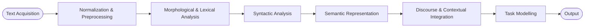

# Classical NLP pipeline

The end-to-end sequence by which a machine processes language. Language is converted into **structured representations** (numerical vectors or symbolic forms) so algorithms can compute similarities, probabilities, or predictions.

## Eight stages (slide 13)

1. **Text acquisition** — collect raw input (documents, transcripts, user queries)
2. **Normalization & preprocessing** — lowercasing, punctuation handling, [[tokenization]]
3. **Morphological & lexical analysis** — break tokens into stems / lemmas, identify word forms
4. **Syntactic analysis** — POS tagging, parsing, dependency / constituency structure
5. **Semantic representation** — map structure to meaning ([[semantic-analysis]])
6. **Discourse & contextual integration** — coreference, narrative cohesion, dialogue state
7. **Task modelling** — apply downstream model (classifier, generator, retriever)
8. **Output** — predicted label, generated text, ranked documents, etc.

## Why it matters for the exam

[[tokenization]] is "one of the first steps" in this pipeline (mock Q1) — and tokenization-as-preprocessing must occur **before counting word frequencies** (Quiz I Q43). Modern neural systems blur stages 3–6 (a Transformer integrates morphological, syntactic, and semantic info implicitly), but the classical staged pipeline remains the reference frame for talking about what NLP systems do.
