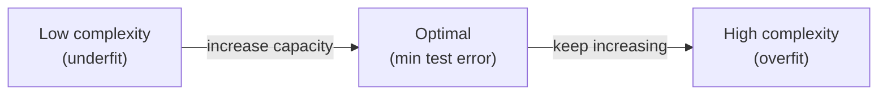

# Overfitting / Underfitting

## Definition

Two failure modes of fitting a predictor $f$ to a finite training set:

- **Underfitting** — the model is too simple to capture the structure in the data. Train error is high, test error is also high. Symptom: bias dominates.
- **Overfitting** — the model is so flexible that it has memorised noise in the training set. Train error is very low (often zero), but test error is high because the patterns it learned do not generalise. Symptom: variance dominates.
- **Optimal** — somewhere in the middle: model just flexible enough to capture real structure but not enough to chase noise. Train and test errors are both moderate, with the smallest test error.

The canonical visual is three decision boundaries on the same 2D classification problem: a near-straight line (underfit), a gently-curved line (optimal), a wiggly line that snakes around individual training points (overfit). Slide 26 of L01 names them explicitly: "Underfitting / Optimal / Overfitting" ([[30-Sources/Statistical-Learning/pdf/SLP-Lec1-knn(1).pdf#page=26|slide 26]]).

## How model complexity controls the regime

The U-shape of test error in model complexity is universal:

Knobs that move along this axis differ by algorithm:

| Algorithm | Knob → low complexity | Knob → high complexity |
| --- | --- | --- |
| [[k-nearest-neighbors|kNN]] | $k \to n$ | $k = 1$ |
| Decision tree | shallow / aggressive pruning | grow deep, no prune |
| Polynomial regression | low degree | high degree |
| Regularised models | large $\lambda$ | $\lambda \to 0$ |
| Boosting | few rounds | many rounds |
| MLP | few hidden units | many hidden units |

## Diagnosing

- **Train error ≪ test error** → likely overfitting. Reduce capacity, add regularization, get more data.
- **Train error high *and* close to test error** → likely underfitting. Increase capacity or use richer features.
- The two error curves vs. training-set size also separate the regimes: in overfitting the gap between train and test error stays large; in underfitting both errors plateau at a high value. (See L11 bias–variance treatment.)

## Occam's razor and why simple wins

Among candidate models that fit the training data equally well, prefer the simpler one — it generalises better in expectation. L01 names this **Occam's razor** explicitly when contrasting a clean linear fit vs. a wiggly polynomial through the same 4 points ([[30-Sources/Statistical-Learning/pdf/SLP-Lec1-knn(1).pdf#page=21|slide 21]]).

## L11's formal restatement: bias and variance

[[lecture-11-bias-variance|SLP L11]] gives the formal vocabulary for these regimes:

- **Underfitting = high bias.** $\bar{h}(x)$ is far from $\bar{y}(x)$; even with infinite data the model class can't match the truth.
- **Overfitting = high variance.** $\bar{h}(x)$ may be close to $\bar{y}(x)$, but individual $h_D(x)$'s scatter widely around $\bar{h}$ — re-training on a different dataset gives a different fit.
- The U-shape of test error in complexity is exactly **bias² + variance + noise** plotted against complexity: bias falls, variance rises, noise stays flat, total has a minimum.

Diagnosing from a [[learning-curve]] (error vs $N$):

- **Wide gap** between train and val, train below ε = high variance / overfitting.
- **Both curves above ε** with small gap = high bias / underfitting.
- **Both above ε after fixes** = data is noise-dominated.

## Related

- [[bias-variance-decomposition]] — formalises the trade-off (L11).
- [[learning-curve]] — diagnostic tool from L11.
- [[cross-validation]] — how to detect the regime in practice.
- [[regularization]] — moves you along the curve (L10).
- [[k-nearest-neighbors]]
