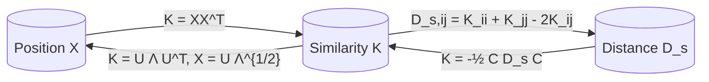

# Position-Distance-Similarity (the Golden Trio)

In Euclidean space, **three matrices encode the same dataset**, and any one can be computed from any other:

| Matrix | Symbol | Shape | Definition |
| --- | --- | --- | --- |
| **Position** | $X$ | $n \times d$ | rows = data points |
| **Similarity** (Gram) | $K$ | $n \times n$ | $K_{ij} = \langle x_i, x_j \rangle$ |
| **Squared distance** | $D_s$ | $n \times n$ | $D_{s,ij} = \|x_i - x_j\|^2$ |

This trio is the conceptual scaffolding for every method in [[lecture-19-dim-reduction-ii|L19]]: choose the matrix most natural for your input, convert to whichever the algorithm needs.

## The conversions

**Position → Similarity.** $K = XX^\top$ — direct.

**Similarity → Distance.** Expand $\|x_i - x_j\|^2 = \langle x_i, x_i\rangle + \langle x_j, x_j\rangle - 2\langle x_i, x_j\rangle$ to get $D_{s,ij} = K_{ii} + K_{jj} - 2K_{ij}$.

**Distance → Similarity.** The double-centring trick:
$$
K = -\tfrac{1}{2} C D_s C, \qquad C = I - \tfrac{1}{n} \mathbf{1}\mathbf{1}^\top.
$$
$C$ is the centring matrix; $C D_s C$ subtracts the row mean and column mean of $D_s$. The result is a valid centred Gram matrix.

**Similarity → Position.** Eigendecompose $K = U \Lambda U^\top$ and embed $X = U \Lambda^{1/2}$. The result is an embedding consistent with $K$, unique up to a rigid transformation (rotation / reflection / translation).

## Why this is the right abstraction

Many algorithms (kernel SVM, kernel PCA, MDS, ISOMAP) only need pairwise relationships, not coordinates. The Golden Trio says: *the choice of $X$, $K$, or $D$ is a matter of convenience — they're interchangeable*. This is the basis of:

- **[[kernel-trick|Kernel methods]]** — supply $K$ directly, never form $X$.
- **[[multidimensional-scaling|MDS]]** — supply $D$ (e.g., perceptual distances), recover $X$.
- **[[isomap|ISOMAP]]** — supply geodesic $D$, recover an *unrolled* $X$.

## Related

- [[multidimensional-scaling]] — the canonical $D \to X$ algorithm.
- [[kernel-pca]] — $K \to$ embedding for non-linear PCA.
- [[kernel-trick]] — the broader machinery.
- [[lecture-19-dim-reduction-ii]].
