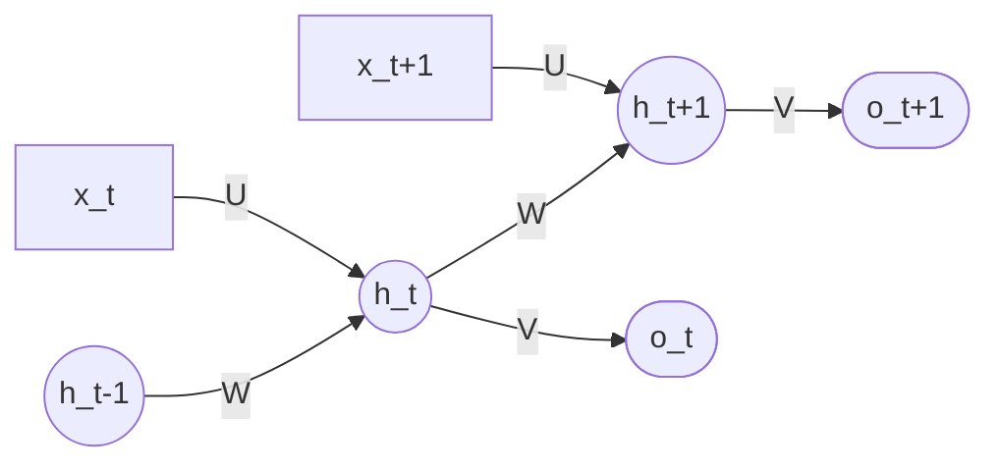

# Recurrent Neural Network (RNN)

A neural architecture designed to **model ordered data** by maintaining a **hidden state** that summarizes the sequence seen so far ([[30-Sources/NLP/pdf/Session 17 - Recurrent NN.pdf#page=4|slide 4]]). At each step, the same parametric cell is applied to the current input and the previous hidden state, producing a new hidden state that captures contextual information.

The blueprint flags this as **high weight**: mock Q13 (RNN role/purpose), Quiz IV Q1–Q2 (RNN, BPTT), and B variants. The formula sheet provides the RNN update.

## The Elman RNN ([[30-Sources/NLP/pdf/Session 17 - Recurrent NN.pdf#page=6|slide 6]])

The classical formulation. Components:
- **Input** $x_t \in \mathbb{R}^d$ — embedding of token at step $t$
- **Hidden state** $h_t \in \mathbb{R}^h$ — initialized to zero, updated at each step
- **Output** $o_t$ — projection of $h_t$ to logits, softmaxed for next-token probabilities

## The recurrence ([[30-Sources/NLP/pdf/Session 17 - Recurrent NN.pdf#page=7|slide 7]] / formula sheet)

**Slide form:**
$$a_t = b_h + W h_{t-1} + U x_t$$
$$h_t = \tanh(a_t)$$

**Formula-sheet form (no bias, label swap):**
$$h_t = \tanh(W x_t + U h_{t-1})$$

Either way: the new hidden state is a **nonlinear blend** of the previous hidden state and the current input. The same weights $U, W$ are applied at every step — **a single cell unrolled in time** ([[30-Sources/NLP/pdf/Session 17 - Recurrent NN.pdf#page=7|slide 7]]).

**Output map:**
$$o_t = b_o + V h_t$$
$$\hat{y}_t = \mathrm{softmax}(o_t)$$

## What the hidden state encodes ([[30-Sources/NLP/pdf/Session 17 - Recurrent NN.pdf#page=10|slide 10]])

> "$h_t = f(x_1, x_2, \ldots, x_t)$ — a learned representation of the entire sequence up to time $t$."

For "I like natural language processing":
- $h_1 \approx$ representation of "I"
- $h_2 \approx$ representation of "I like"
- $h_3 \approx$ representation of "I like natural"
- ...

The hidden state is a **compressed memory of the preceding context** — fixed-size regardless of how long the sequence is. This is the key architectural feature: **context distilled into a fixed-dim vector** (mock Q13).

## Folded vs unfolded view ([[30-Sources/NLP/pdf/Session 17 - Recurrent NN.pdf#page=7|slide 7]])



Important: in an RNN there is **only one cell** with one set of weights $U, W, V$ — the "unrolled" picture is just the same cell applied at each time step ([[30-Sources/NLP/pdf/Session 17 - Recurrent NN.pdf#page=7|slide 7]]). The parameters do **not** grow with sequence length.

## Training as a language model ([[30-Sources/NLP/pdf/Session 17 - Recurrent NN.pdf#page=8|slides 8–11]])

Trained to predict the next token: $p_\theta(w_{t+1} \mid w_1, \ldots, w_t)$.

Implemented by learning:
- **Embeddings $E$** — input layer
- **Recurrent dynamics $U, W, b_h$** — how the hidden state evolves
- **Output map $V, b_o$** — projects hidden state to vocabulary logits

Loss = negative log-likelihood of next token, summed over the sequence:
$$L = -\sum_t \log P(w_{t+1} \mid w_{1\ldots t})$$
Trained by [[bptt|backpropagation through time]] + SGD/Adam.

## Inference ([[30-Sources/NLP/pdf/Session 17 - Recurrent NN.pdf#page=11|slide 11]])

After training, parameters are **fixed**. Given a new sequence, hidden states are computed sequentially; the model outputs a probability distribution over the next token. Hidden states are **recomputed per input sequence** — they are not stored. The RNN acts as a **function that maps sequences to probabilities or representations**.

## Types of RNN tasks ([[30-Sources/NLP/pdf/Session 17 - Recurrent NN.pdf#page=16|slide 16]])

| Pattern | Example task | Output structure |
|---|---|---|
| **Many-to-one** | Sentiment classification | Sequence in → single label (use final hidden state) |
| **One-to-many** | Text generation from prompt | Single input → sequence out |
| **Many-to-many (aligned)** | POS tagging, NER | Per-token output, same length as input |
| **Many-to-many (encoder-decoder)** | Machine translation | Variable-length input → variable-length output |

## Limitations ([[30-Sources/NLP/pdf/Session 17 - Recurrent NN.pdf#page=13|slides 13–15]])

**Cannot be parallelized across the sequence:** $h_t$ requires $h_{t-1}$, forcing strictly sequential computation. This is what transformers fix.

**Vanishing / exploding gradients ([[vanishing-exploding-gradients]]):** BPTT propagates gradients through the recurrent weight matrix at every step. Spectral radius < 1 → vanishing; > 1 → exploding. In practice vanishing dominates, limiting effective context to **5–10 tokens** ([[30-Sources/NLP/pdf/Session 17 - Recurrent NN.pdf#page=14|slide 14]]).

**No selective attention:** every input contributes through the same $U$ — no mechanism to weight relevant tokens more than irrelevant ones. *"We cannot choose which tokens are better for the update and which should be left out"* ([[30-Sources/NLP/pdf/Session 17 - Recurrent NN.pdf#page=14|slide 14]]).

These motivate [[lstm|LSTM]] (gates protect long-term memory) and ultimately [[attention|attention mechanisms]] (direct token-to-token connections).

## Exam framing

| Question | Answer |
|---|---|
| What does an RNN's hidden state encode? | A **fixed-size representation of the past context** — a learned summary of all tokens seen so far (mock Q13) |
| How many "cells" are in an unrolled RNN? | **One** — the same cell with one set of weights, applied at every time step ([[30-Sources/NLP/pdf/Session 17 - Recurrent NN.pdf#page=7|slide 7]]) |
| What's the RNN update on the formula sheet? | $h_t = \tanh(W x_t + U h_{t-1})$ |
| Why can't RNNs be parallelized? | $h_t$ depends on $h_{t-1}$, forcing strictly sequential computation |
| What's the practical effective context length of a vanilla Elman RNN? | **5–10 tokens** ([[30-Sources/NLP/pdf/Session 17 - Recurrent NN.pdf#page=14|slide 14]]) |
| What kind of NLP task is "many-to-one"? | A sequence in, single output — e.g. **sentiment classification** using the final hidden state ([[30-Sources/NLP/pdf/Session 17 - Recurrent NN.pdf#page=16|slide 16]]) |

## Related

- [[vanishing-exploding-gradients]] — why simple RNNs lose long-range information
- [[bptt|Backpropagation Through Time]] — the training algorithm
- [[lstm]] — gated successor that mitigates vanishing gradients
- [[gru]] — simpler gated alternative
- [[attention]] — what eventually replaces the recurrence
- [[activation-function]] — $\tanh$ is the canonical RNN nonlinearity

## Canonical Elman RNN language-model skeleton (PyTorch)

```python
import torch
import torch.nn as nn
import torch.nn.functional as F

class ElmanRNNLM(nn.Module):
    """
    Elman RNN language model:
      h_t = tanh(W_hh h_{t-1} + W_ih e_t + b_h)
      logits_t = W_ho h_t + b_o
    """
    def __init__(self, embedding_matrix, hidden_dim=128, freeze_embeddings=False):
        super().__init__()
        vocab_size, embed_dim = embedding_matrix.shape
        self.embedding = nn.Embedding.from_pretrained(
            torch.tensor(embedding_matrix), freeze=freeze_embeddings
        )
        self.W_ih = nn.Linear(embed_dim, hidden_dim, bias=False)
        self.W_hh = nn.Linear(hidden_dim, hidden_dim, bias=True)
        self.W_ho = nn.Linear(hidden_dim, vocab_size)

    def forward(self, x, h_prev=None):
        e = self.embedding(x)             # [B, T, embed_dim]
        if h_prev is None:
            h_prev = torch.zeros(x.size(0), self.W_hh.out_features)
        outputs = []
        for t in range(x.size(1)):
            h_t = torch.tanh(self.W_ih(e[:, t]) + self.W_hh(h_prev))
            logits_t = self.W_ho(h_t)
            outputs.append(logits_t)
            h_prev = h_t
        return torch.stack(outputs, dim=1), h_prev
```

Reference: `[Elman RNN language model (cells 9–11)](30-Sources/NLP/notebooks/16_Elman_RNNs.ipynb)`.

**Exam-critical observations:**
- The recurrence is **inside a Python `for` loop** over time — explicit serial dependency on $h_{t-1}$, illustrating why RNNs cannot parallelize across time
- Embeddings can be **initialized from Word2Vec** (`nn.Embedding.from_pretrained(...)`) and either frozen or fine-tuned
- Loss is the standard cross-entropy on next-token prediction over the sequence
