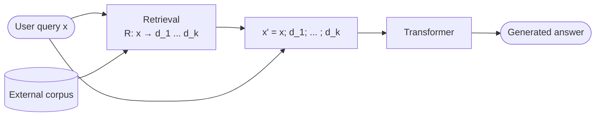

# Retrieval-Augmented Generation (RAG)

A **hybrid system** that combines a [[transformer|generative model]] with an explicit **retrieval step**: given a user query, the system fetches relevant documents from an external corpus and conditions generation on **both** the query and the retrieved context ([[30-Sources/NLP/pdf/Session 24 - Challenges and futures.pdf#page=11|slides 11–13]]).

The blueprint flags this as **low weight** but explicitly tested: **mock Q22** asks which approach combines retrieval with generation to incorporate external knowledge → answer: **RAG**.

## Why RAG exists ([[30-Sources/NLP/pdf/Session 24 - Challenges and futures.pdf#page=10|slide 10]])

A standard transformer has **fundamental knowledge limitations**:
- Information is **frozen in parameters** — updates require retraining or fine-tuning, both costly and slow
- Cannot access **external sources** at inference time
- Cannot distinguish updated/outdated, certain/uncertain, correct/incorrect
- Outputs only reflect **patterns** from training data — no structured or verifiable fact storage

RAG addresses these by **moving knowledge out of the parameters and into an updatable corpus**.

## The two components ([[30-Sources/NLP/pdf/Session 24 - Challenges and futures.pdf#page=12|slide 12]])

**1. Geometric / retrieval part** ([[30-Sources/NLP/pdf/Session 24 - Challenges and futures.pdf#page=12|slide 12]]):
- Knowledge stored in an **external corpus**
- Retrieval implemented via **embeddings** $\phi(x) \in \mathbb{R}^n$ and **similarity** measures (typically cosine)
- For a query $x$, retrieve top-$k$ documents:
$$d_i = \arg\max_{d \in \mathcal{D}} \mathrm{sim}(\phi(x), \phi(d))$$

**2. Generative part** ([[30-Sources/NLP/pdf/Session 24 - Challenges and futures.pdf#page=12|slide 12]]):
- Standard transformer language model
- Conditions on the query AND retrieved documents
- Final prediction:
$$\hat{y} = \arg\max_y p_\theta(y \mid x, R(x))$$

## How retrieved docs enter the model ([[30-Sources/NLP/pdf/Session 24 - Challenges and futures.pdf#page=13|slide 13]])

The retrieved documents are **inserted into the prompt**, effectively extending the context:
$$x' = [x; d_1; d_2; \ldots; d_k]$$
The model processes $x'$ as a **single sequence**. The "context" is no longer just the original input — it now includes **dynamically selected information** from external sources.

## What RAG fixes ([[30-Sources/NLP/pdf/Session 24 - Challenges and futures.pdf#page=11|slide 11]])

| Problem of pure transformer | RAG fix |
|---|---|
| Frozen knowledge | Update the corpus, no retraining needed |
| No external info | Documents fetched per query at inference |
| Can't distinguish certain from uncertain | Documents serve as evidence; cite sources |
| Hallucinations | Generation grounded in retrieved text |

> "The model now generates an answer conditioned not only on its internal parameters, but also on retrieved information. This combination of retrieval and generation defines a new paradigm." ([[30-Sources/NLP/pdf/Session 24 - Challenges and futures.pdf#page=11|slide 11]])

## Practical example ([[30-Sources/NLP/pdf/Session 24 - Challenges and futures.pdf#page=11|slide 11]])

Query: "What's the interest rate in Japan?"

1. **Retrieval**: search the corpus for documents about Japanese interest rates → returns recent Bank of Japan statements
2. **Augmentation**: concatenate the documents with the query
3. **Generation**: transformer answers "The interest rate in Japan is -0.10%" — grounded in the retrieved documents, not internal stale knowledge

## Limits even with RAG ([[30-Sources/NLP/pdf/Session 24 - Challenges and futures.pdf#page=14|slides 14–15]])

Despite the extension, RAG still operates within a **finite context window**:
- Self-attention is **$O(T^2)$** in context length
- Attention weights spread across more tokens → **relevance per token decreases**
- Trade-off between **fitting more retrieved docs** and **keeping attention focused**

This is the bridge to **Large Context Models** ([[30-Sources/NLP/pdf/Session 24 - Challenges and futures.pdf#page=16|slide 16]]) — extending $T$ from thousands to millions of tokens, but shifting the problem from access to **allocation of attention**.

## Exam framing

| Question | Answer |
|---|---|
| Which approach combines retrieval with generation to incorporate external knowledge? | **RAG** — Retrieval-Augmented Generation (mock Q22) |
| What two components does a RAG system have? | (1) **Retrieval** — embeddings + similarity over external corpus. (2) **Generation** — transformer language model conditioned on query + retrieved docs ([[30-Sources/NLP/pdf/Session 24 - Challenges and futures.pdf#page=12|slide 12]]) |
| What problem does RAG solve? | The transformer's **frozen / unverifiable internal knowledge** — RAG moves knowledge into an updatable external corpus |
| How are retrieved docs incorporated? | **Concatenated with the query** as input to the transformer: $x' = [x; d_1; \ldots; d_k]$ ([[30-Sources/NLP/pdf/Session 24 - Challenges and futures.pdf#page=13|slide 13]]) |
| What's the retrieval function $R$? | Maps a query $x$ to top-$k$ documents by **similarity in embedding space**: $R: x \mapsto \{d_1, \ldots, d_k\}$ |

## Related

- [[transformer]] — the generative component
- [[attention]] / [[self-attention]] — the mechanism by which retrieved docs influence generation
- [[word-embeddings]] — used by the retrieval step (the $\phi$ embedding function)
- [[cosine-similarity]] — typical similarity measure for retrieval
- [[information-retrieval-ranking]] — the classical IR backbone of the retrieval step
