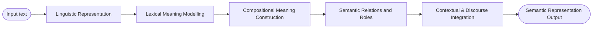

# Semantic analysis

The stage in the [[nlp-pipeline]] concerned with **meaning**. The process by which a system maps linguistic expressions to representations of meaning, going beyond grammatical structure. Goal: determine **what is being said**, not just how it is written.

## The framing

> Syntax answers: "Is this sentence well-formed?"
> Semantic analysis answers: "What does this sentence mean?"

## Components (slide 6)

- **Resolving ambiguity** — the same word or structure can have different meanings depending on context (see [[language-ambiguity]])
- **Modelling relationships** between words and concepts: similarity, entailment, semantic roles, references
- **Connecting language to internal representations** — vectors (e.g. [[word2vec|Word2Vec]]), logical forms, knowledge graphs, latent semantic spaces

## Pipeline view

Modern neural NLP collapses these stages into learned distributed representations (embeddings → contextual vectors → attention-based composition). The classical staged framing is still the reference vocabulary for what semantic analysis is *doing*, even when no explicit stage exists in the model.
