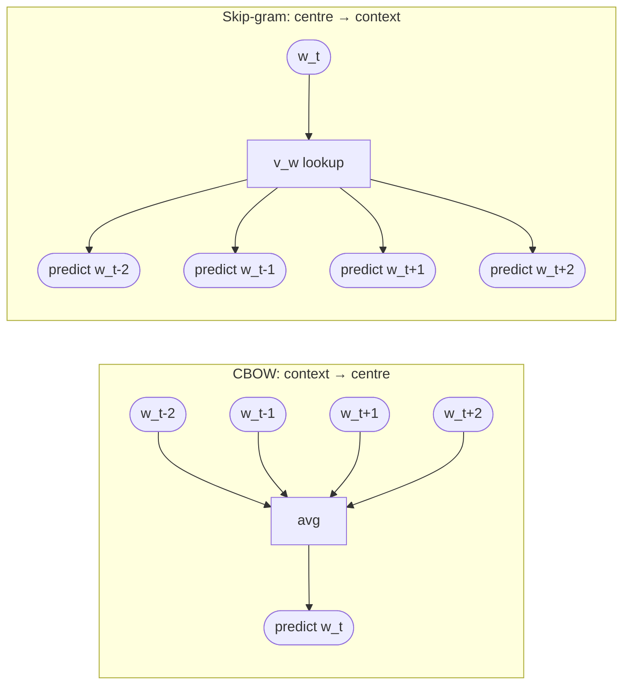

# Skip-gram and CBOW

The **two symmetric formulations** of [[word2vec|Word2Vec]] ([[30-Sources/NLP/pdf/Session 13 - Word Embeddings.pdf#page=12|slide 12]]). Both learn the same kind of dense [[word-embeddings]]; they differ only in which way the prediction runs.

| Formulation | Input | Predict |
|---|---|---|
| **CBOW** — Continuous Bag-of-Words | surrounding **context words** | the **centre word** $w_t$ |
| **Skip-gram** | the **centre word** $w_t$ | each **surrounding context word** |

The blueprint flags this contrast as **high weight**: mock Q6, Quiz III Q7–Q9, Q18 (and Model B variants).

## CBOW: context → centre

Inputs: a window of context words $\{w_{t-k}, \ldots, w_{t-1}, w_{t+1}, \ldots, w_{t+k}\}$.
Operation: average (or sum) the input vectors, project, and predict $w_t$ via softmax over $V$.

Strengths:
- **Faster to train** (one prediction per centre word, regardless of window size)
- Smooths over context — performs well on **frequent words**

## Skip-gram: centre → context

Inputs: the centre word $w_t$.
Operation: for each context position, predict the context word using softmax over $V$.

Strengths:
- Each centre word produces $|window|$ training pairs → **more updates per word**
- Handles **rare words** better — gets more gradient signal per word
- The "Skip-gram with negative sampling" (SGNS) variant is the dominant Word2Vec setup in practice

## The Skip-gram objective ([[30-Sources/NLP/pdf/Session 13 - Word Embeddings.pdf#page=14|slides 14–15]])

Probability of context word $c$ given centre word $w$:
$$P(c \mid w) = \frac{\exp(v_c^\top v_w)}{\sum_{w' \in V} \exp(v_{w'}^\top v_w)}$$

Maximize over the corpus:
$$\sum_{t=1}^{T} \sum_{c \in \mathcal{C}(w_t)} \log P(c \mid w_t)$$

Optimized by **stochastic gradient descent**. The full softmax denominator (sum over $V$) is computationally infeasible for realistic vocabularies — replaced in practice by [[negative-sampling]] ([[30-Sources/NLP/pdf/Session 13 - Word Embeddings.pdf#page=16|slide 16]]).

## Visual contrast

*Same data, opposite prediction directions. Both learn the same embedding matrix $W \in \mathbb{R}^{V \times d}$.*

## Exam framing

| Question | Answer |
|---|---|
| What does CBOW predict? | The **centre word** given surrounding context (mock Q6; Quiz III Q8) |
| What does Skip-gram predict? | The **context words** given the centre word (Quiz III Q9 / Q9.B) |
| Why is Skip-gram preferred for rare words? | More training updates per word — each centre word generates one pair per context position |
| What is the role of the softmax in P(c\|w)? | Normalizes the dot-product scores into a probability distribution over the vocabulary |
| What's the theoretical issue with the full softmax? | Denominator is a sum over $V$ — for $V = 10^5$, $\sim 10^9$ pairs × $V$ becomes infeasible ([[30-Sources/NLP/pdf/Session 13 - Word Embeddings.pdf#page=16|slide 16]]) |

## Related

- [[word2vec|Word2Vec]] — the parent framework
- [[negative-sampling]] — the practical training trick that replaces full softmax
- [[embedding-matrix]] — the $V \times d$ parameter table both share
- [[distributional-hypothesis]] — what both formulations operationalize
