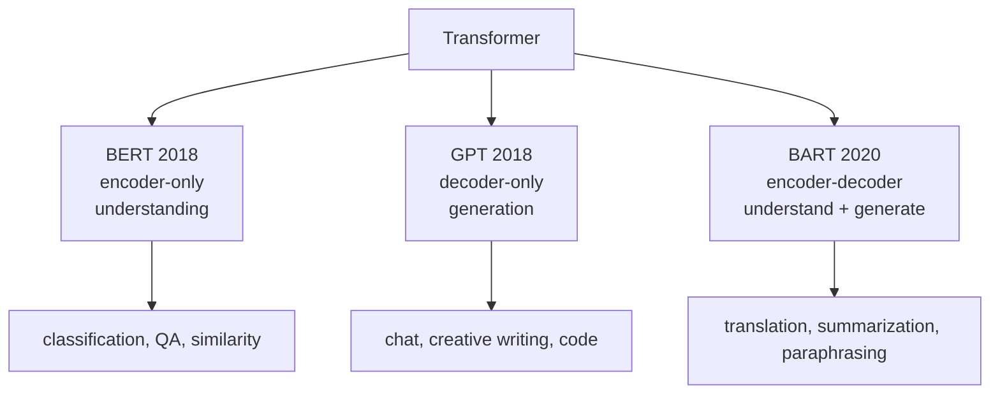

# Transformer

The **transformer** (Vaswani et al. 2017) is a sequence model built entirely from [[self-attention]] and feed-forward layers — **no recurrence, no convolution**. By processing all positions in parallel, transformers eliminate the sequential bottleneck of [[recurrent-neural-network|RNNs]] and capture arbitrarily long-range dependencies via direct attention.

The blueprint flags this as **very high weight**: mock Q16 (false-statement trap on transformers), mock Q24 (RNN/Transformer vs BoW); Quiz IV broadly. The full encoder-decoder architecture is on the formula sheet implicitly via the attention block.

## Why transformers replaced RNNs

| Property | RNN/LSTM | Transformer |
|---|---|---|
| Sequence dependency | Sequential — $h_t$ requires $h_{t-1}$ | **Parallel** — all positions computed simultaneously |
| Long-range dependencies | Vanishing gradients limit ~5–10 tokens | **Direct attention** — $O(1)$ path between any positions |
| Order handling | Built into recurrence | Requires [[positional-encoding]] |
| GPU utilization | Poor (serial) | Excellent (parallel matmul) |
| Compute per layer | $O(L \cdot d^2)$ | $O(L^2 \cdot d)$ — quadratic in sequence length |

The mock Q24 false-statement trap: "transformers process tokens **strictly sequentially**" — **FALSE**. Parallel processing is the whole point.

## Architecture ([[30-Sources/NLP/pdf/Session 19 - Transformers-1.pdf#page=17|slide 17]])

**Encoder block** (repeated $N$ times):
- Multi-head self-attention (no mask)
- Feed-forward network (per-position)
- Residual connections + LayerNorm around each sublayer

**Decoder block** (repeated $N$ times):
- Multi-head **masked** self-attention (causal mask)
- Multi-head **cross-attention** — queries from decoder, K/V from encoder output
- Feed-forward network
- Residual connections + LayerNorm

**Input pipeline:** Tokenized text → token embeddings → + positional encodings → encoder stack → (K, V passed to decoder) → decoder stack → output projection → softmax → token logits.

## Architecture sizes ([[30-Sources/NLP/pdf/Session 19 - Transformers-1.pdf#page=20|slide 20]])

| Model | Stacks | Heads | Hidden size | Parameters |
|---|---|---|---|---|
| BERT base | 12 | 12 | 768 | 110M |
| GPT-3 | 96 | 96 | 12,288 | 175B |
| ViT-Huge | 32 | 16 | 1,280 | 632M |

## The transformer family ([[30-Sources/NLP/pdf/Session 19 - Transformers-1.pdf#page=18|slides 18–19]])

| Model | Architecture | Year | Strength | Limitation |
|---|---|---|---|---|
| **BERT** | Encoder-only | Google 2018 | Bidirectional attention; rich contextual embeddings; great for classification, similarity, **extractive QA** | Cannot generate text without modifying the training objective |
| **GPT** | Decoder-only | OpenAI 2018 | Autoregressive generation; chat, creative writing, code completion | Cannot use future context — limits deeper understanding |
| **BART** | Encoder-decoder | Meta 2020 | Combines BERT-style bidirectional understanding + GPT-style generation; good for translation, summarization, paraphrasing | Higher computational cost; intricate training |

## What transformers capture ([[30-Sources/NLP/pdf/Session 19 - Transformers-1.pdf#page=16|slide 16]])

- **Encoder self-attention:** each token attends to all others in the input. Output is a **sequence of contextualized hidden states** (not a single vector).
- **Decoder masked self-attention:** each position attends only to previous target tokens — **enforces autoregressive generation without recurrence**.
- **Cross-attention:** queries from decoder, K/V from encoder output. The "context" is a *sequence* of hidden states — **no global fixed-length summary of the input**.

## Common MCQ traps

- **"Transformers are sequential"** — FALSE. They're parallel; positional encoding restores order (mock Q16 / Q24).
- **"BERT generates text"** — Not directly. BERT is encoder-only, designed for understanding; generation requires architectural modification.
- **"GPT understands semantics"** — GPT's understanding is **statistical, not semantic** ([[30-Sources/NLP/pdf/Session 19 - Transformers-1.pdf#page=18|slide 18]]).
- **"Cross-attention sits in the encoder"** — No, cross-attention is a **decoder** sublayer (queries from decoder, K/V from encoder).

## Exam framing

| Question | Answer |
|---|---|
| What's the central architectural innovation of transformers? | **Self-attention** — replaces recurrence with direct token-to-token attention, enabling parallelism |
| What's the trick that prevents transformers from being permutation-invariant? | **Positional encoding** added to token embeddings ([[30-Sources/NLP/pdf/Session 19 - Transformers-1.pdf#page=14|slide 14]]) |
| Which transformer family member is encoder-only? | **BERT** — used for classification, similarity, extractive QA |
| Which is decoder-only? | **GPT** — autoregressive generation |
| Which is encoder-decoder? | **BART** — combines understanding and generation; used for translation, summarization |
| What's the complexity of self-attention in sequence length $L$? | $O(L^2)$ — quadratic; the main scaling bottleneck (Quiz IV Q10) |

## Related

- [[self-attention]], [[scaled-dot-product-attention]], [[multi-head-attention]] — the building blocks
- [[positional-encoding]] — restores order for parallel processing
- [[causal-masking]] — makes the decoder autoregressive
- [[cross-attention]] — connects decoder to encoder
- [[encoder-decoder]] — the architecture transformer perfects
- [[extractive-question-answering]] — typical BERT-based application (mock Q19 / Q30)
