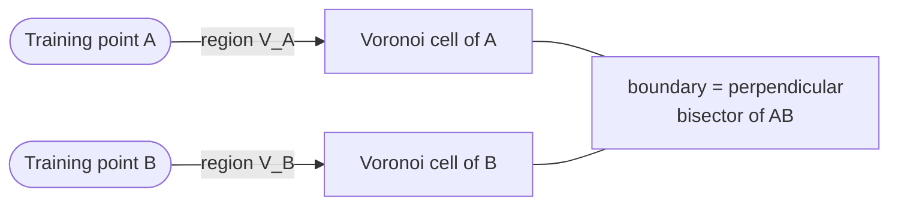

# Voronoi Diagram

## Definition

A partition of a metric space into **cells**, one per training point, where each cell is the locus of query points closest to that training point. Formally, for training points $\{\mathbf{x}^{(1)}, \dots, \mathbf{x}^{(n)}\}$, the Voronoi cell of $\mathbf{x}^{(i)}$ is

$$
V_i = \bigl\{\mathbf{q} \in \mathbb{R}^d \;\big|\; \mathrm{dist}(\mathbf{q}, \mathbf{x}^{(i)}) \le \mathrm{dist}(\mathbf{q}, \mathbf{x}^{(j)}) \text{ for all } j \neq i\bigr\}.
$$

Cell boundaries are perpendicular bisectors of segments between adjacent training points.

## Why it matters

The Voronoi diagram **is the 1-NN classifier**:

- Each query falls in exactly one cell → predicted label = label of that cell's training point.
- The 1-NN decision boundary is the union of cell-boundary segments **between cells of opposite classes**. Cell-boundaries between same-class cells are *not* part of the decision boundary.

This makes the 1-NN decision boundary **piecewise linear** in $\mathbb{R}^d$, but with potentially exponentially many pieces.

> *"Decision boundaries: Voronoi diagram visualization — show how input space divided into classes; each line segment is equidistant between two points of opposite classes."* ([[30-Sources/Statistical-Learning/pdf/SLP-Lec1-knn(1).pdf#page=57|slide 57]])

## Geometry

For two points the boundary is a single line (in 2D) or hyperplane (in $\mathbb{R}^d$). For $n$ points the diagram is a tessellation of convex polytopes.

## Why kNN ($k>1$) does *not* trace a Voronoi diagram

For $k > 1$, the decision rule is a vote among the $k$ closest training points, not "label of the single closest." The boundary is no longer the Voronoi tesselation — it smooths out the cell-by-cell decisions and tends to ignore lone noisy points.

## Related

- [[k-nearest-neighbors]]
