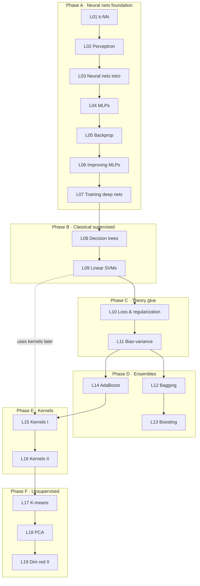

# Lecture-order rationale

Why the lectures are numbered L01–L19 in the order given in [[_course|`_course.md`]], even though PDFs after L07 carry no numbers in their filenames.

## The five phases

## Dependencies — why the order is what it is

- **A → B**: Phase A is self-contained (neural nets). Phase B switches modality to classical ML; the only thing it inherits is the *idea* of a parametric classifier.
- **L08 before L09**: the real dependency isn't the entropy machinery (AdaBoost doesn't need entropy — it just needs weak learners). It's that decision *stumps* (depth-1 trees) are the canonical AdaBoost weak learner. Trees being earlier means by the time L14 arrives, the student already knows what a stump is. The mock exam tests both (§3 trees, §5 AdaBoost) with stumps glued through.
- **L09 → L10**: soft-margin SVM is the **first concrete regularizer** the student sees (the $C$ parameter). L10 then gives the general theory (L1 / L2 / elastic net). If L10 came before L09, regularization would be ungrounded abstraction.
- **L10 → L11**: bias–variance is the theoretical *explanation* for what regularization does. Easier after seeing concrete regularizers.
- **L11 → L12 → {L13, L14}**: bias–variance gives you the language ("bagging reduces variance, boosting reduces bias"). Bagging is the simpler ensemble (parallel). L13 covers the general boosting framework + gradient boosting specifically (squared loss). L14 (AdaBoost) is a **sibling** algorithm in the same framework — different loss function (exponential), different update rule. The L13 → L14 ordering is "first-introduced → second-introduced," not "general → specific." Mock §1g and §2a depend directly on this vocabulary.
- **L14 → L15 → L16**: kernels could legitimately sit right after L09 (completing the SVM story) or here (treating kernels as a separate method family). The prof chose the latter; both work pedagogically.
- **F is independent**: clustering and PCA use none of A–E directly. The course parks them last.

## Phase boundaries

Lectures that sit on a phase boundary need **invented bridge prose** in the opening — the previous lecture's "Open questions" won't naturally seed the next lecture, so the lecture note must explicitly mark the shift in modality.

| Lecture | Boundary | Bridge framing |
| --- | --- | --- |
| L08 | Phase A → B | "We leave neural networks for now and turn to classical supervised learning; trees and SVMs solve the same classification problem with very different machinery." |
| L10 | Phase B → C | "Both trees and SVMs raised the question: how do we control model complexity? L10 answers it generally." |
| L12 | Phase C → D | "Bias–variance gave us the lens; ensembles are the practical machinery for moving along it." |
| L15 | Phase D → E | "Boosting linearly combines weak learners. Kernels do something orthogonal — they enrich a *single* learner's feature space." |
| L17 | Phase E → F | "Everything so far has been supervised — labels were given. We now turn to unsupervised learning, where the only signal is the data itself." |

## Filename → number mapping

Numbers 01–07 are explicit in PDF filenames. Numbers 08–19 are inferred from the dependency order above. The mapping in `_course.md` is **authoritative** — do not re-derive it from filenames or content order, because lecture-note slugs (`lecture-08-decision-trees`, etc.) and the blueprint's topic-coverage map already reference these numbers everywhere.

## One unresolved minor question

~~Resolved in batch 3:~~ L13 covers both general boosting and gradient boosting; AdaBoost is a sibling. See updated dependency note above.
